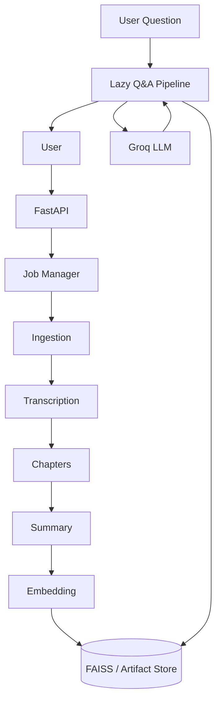

<h1 align="center">🎥 VideoMind</h1>

<p align="center">
  <strong>Understand any video without watching it.</strong>
</p>

<p align="center">
  
  
  
  
  
  
  
  
  
  
  
  
</p>


---

## 🚀 What is VideoMind?

**VideoMind turns long videos into searchable, grounded knowledge.**

Paste a video URL or upload a video and VideoMind automatically:

```text
Video
  ↓
Transcription
  ↓
Semantic Structure
  ↓
Chapter Detection
  ↓
Grounded Summary
  ↓
Semantic Search
  ↓
Question & Answer
```

Instead of watching an entire video, you can jump directly to the parts that matter and ask questions about the content.

### ✨ Core Features

| Feature                  | Description                                                          |
| ------------------------ | -------------------------------------------------------------------- |
| 🎙️ **Transcription**    | Converts video/audio into searchable text                            |
| 🧭 **Semantic Chapters** | Detects meaningful topic changes instead of arbitrary time intervals |
| 📝 **Grounded Summary**  | Generates a summary from the actual transcript                       |
| 🔎 **Semantic Search**   | Finds relevant transcript sections using embeddings + FAISS          |
| 💬 **Transcript Q&A**    | Ask questions and get answers grounded in the video                  |
| ⏱️ **Timestamp Context** | Answers can be traced back to the relevant moment                    |
| 👥 **Concurrent Jobs**   | Supports multiple users without sharing job artifacts                |
| 🧹 **Automatic Cleanup** | Removes temporary audio and old job artifacts                        |

---

## 🏗️ Architecture


### Production Architecture



---

## 🧩 Pipeline Design

VideoMind separates processing into independent stages.

### 1. Ingestion

Accepts:

* YouTube/video URLs
* Uploaded video files

Temporary source audio is removed as soon as it is no longer required.

### 2. Transcription

Audio is chunked without unnecessary re-encoding and sent to Groq's transcription API.

The application does **not** keep a Whisper model resident in memory.

### 3. Semantic Chapters

Instead of dividing a video into fixed time windows, VideoMind identifies meaningful topic transitions.

This produces chapters based on the **content of the discussion**, not simply elapsed time.

### 4. Grounded Summary

The summary is generated from the transcript and designed to remain grounded in the source material.

Chapters and summary execute sequentially in production to reduce peak memory usage.

### 5. Semantic Index

Transcript content is converted into embeddings and indexed with FAISS.

Embedding generation happens in small batches so large videos do not unnecessarily accumulate all vectors and metadata in memory.

### 6. Question Answering

The Q&A system is intentionally lazy.

A completed job does not immediately load:

* FAISS
* transcript metadata
* LLM client

These resources are initialized only when the user asks the first question.

---

# ⚙️ Production Engineering

Building the pipeline was only half the problem.

Running it reliably on a small cloud instance introduced several additional engineering challenges.

## 🛡️ YouTube Extraction on Cloud Infrastructure

YouTube behaves differently toward datacenter IPs than normal residential connections.

The production deployment therefore combines:

* 🍪 authenticated browser cookies
* 🔐 PO token generation
* 🟢 Node.js JavaScript runtime
* `yt-dlp`

The PO token provider runs alongside the application and is exposed only locally.

```text
Render
│
├── FastAPI
│
├── yt-dlp
│
├── Node.js
│
└── PO Token Provider
        │
        └── 127.0.0.1:4416
```

This is treated as an ongoing maintenance surface rather than a permanently solved integration.

---

# 👥 Concurrency Without Cross-User Collisions

Every request receives its own job ID.

```text
artifact/
└── jobs/
    ├── job_8f21.../
    │   ├── audio/
    │   ├── transcript/
    │   ├── chapters/
    │   └── embeddings/
    │
    └── job_a93c.../
        ├── audio/
        ├── transcript/
        ├── chapters/
        └── embeddings/
```

Each pipeline is created with its own artifact directory:

```python
VideoPipeline(artifact_dir=job_artifact_dir)
```

This prevents simultaneous users from touching the same runtime files.

### Concurrency limits

| Limit                   |           Value |
| ----------------------- | --------------: |
| Heavy pipelines         |           **2** |
| Open jobs globally      |           **2** |
| Jobs per browser        |           **1** |
| Retained completed jobs |           **2** |
| Validation cache TTL    | **120 seconds** |
| Validation cache size   |   **8 entries** |

The limits are intentional: a third heavy request is rejected rather than silently degrading every active job.

---

# 🧠 Memory-Aware Design

Video processing can become memory-heavy quickly.

VideoMind therefore releases resources at stage boundaries.

### Key optimizations

**Whisper**

Transcription is performed through Groq rather than keeping a local speech model in RAM.

**Embeddings**

Embeddings are generated in batches:

```text
Transcript
   ↓
Batch 1 → encode → write → release
   ↓
Batch 2 → encode → write → release
   ↓
Batch 3 → encode → write → release
   ↓
...
```

**LLM lifecycle**

The LLM client is created lazily and released after the final LLM-dependent pipeline stage.

**Q&A**

FAISS and Q&A resources are loaded only when the user actually asks a question.

**Garbage collection**

`gc.collect()` is used at meaningful stage boundaries rather than indiscriminately throughout the application.

---

# ⚡ Avoiding Duplicate Work

Several production optimizations prevent unnecessary processing.

### Metadata validation cache

Previously:

```text
Validate URL
     ↓
Extract metadata

Download video
     ↓
Extract metadata AGAIN
```

Now:

```text
Validate URL
     ↓
Bounded metadata cache
     ↓
Download
     ↓
Reuse metadata
```

The cache is:

* 120-second TTL
* maximum 2 reuses
* maximum 8 entries

### Audio processing

Audio chunking uses:

```bash
ffmpeg -c:a copy
```

This performs a stream copy instead of unnecessarily re-encoding the audio.

Supported containers can then pass directly into transcription.

### Cleanup

Temporary source audio is deleted immediately after it is no longer required.

Old completed or failed jobs are also pruned automatically.

---

# 🗂️ Project Structure

```text
VideoMind/
│
├── app.py
│
├── static/
│   ├── index.html
│   ├── style.css
│   └── script.js
│
├── src/
│   ├── components/
│   │   └── pipeline stages
│   │
│   ├── pipeline/
│   │   ├── VideoPipeline
│   │   └── QAPipeline
│   │
│   ├── entity/
│   │   └── configuration + artifact models
│   │
│   ├── utils/
│   │   ├── JSON utilities
│   │   └── embedding utilities
│   │
│   ├── prompts.py
│   └── constants.py
│
├── start.sh
├── requirements.txt
└── README.md
```

Runtime artifacts are intentionally excluded from Git:

```text
artifact/
```

---

# 🛠️ Tech Stack

| Layer            | Technology                 |
| ---------------- | -------------------------- |
| Backend          | FastAPI                    |
| Frontend         | HTML / CSS / JavaScript    |
| Transcription    | Groq                       |
| LLM              | Groq                       |
| Embeddings       | Hugging Face Inference API |
| Vector Search    | FAISS                      |
| Video Extraction | yt-dlp                     |
| Audio Processing | FFmpeg                     |
| PO Token         | bgutil-ytdlp-pot-provider  |
| Runtime          | Python 3.11                |
| Deployment       | Render                     |

---

# 🧪 Production vs Experimentation

VideoMind is split into two repositories intentionally.

### Production

**This repository**

Focuses on:

* FastAPI
* frontend
* concurrency
* memory management
* job isolation
* cleanup
* cloud deployment
* failure handling
* production-specific YouTube extraction

### Experimentation

**VideoMind-RAG-Pipeline**

Focuses on:

* pipeline development
* DVC
* local experimentation
* model/pipeline iteration
* reproducibility

The production repository takes the pipeline developed during experimentation and adapts it for a constrained cloud environment.

> **Experiment → validate → optimize → productionize**

---

# 🚀 Run Locally

### 1. Clone

```bash
git clone <your-repo-url>
cd VideoMind
```

### 2. Create environment

```bash
python -m venv .venv
```

Windows:

```powershell
.venv\Scripts\activate
```

Linux/macOS:

```bash
source .venv/bin/activate
```

### 3. Install dependencies

```bash
pip install -r requirements.txt
```

### 4. Configure environment variables

```env
GROQ_API_KEY=your_groq_key
HF_TOKEN=your_huggingface_token
YOUTUBE_COOKIE_FILE=/path/to/cookies.txt
```

### 5. Start

```bash
uvicorn app:app
```

Then open:

```text
http://localhost:8000
```

> Avoid `--reload` while processing videos because runtime artifact changes can trigger unwanted server restarts.

---

# ☁️ Render Deployment

The production deployment uses Render.

### Build

```bash
pip install -r requirements.txt && \
pip install --upgrade --pre "yt-dlp[default]" && \
rm -rf bgutil-ytdlp-pot-provider && \
git clone --depth 1 --branch 2.0.0 \
  https://github.com/Brainicism/bgutil-ytdlp-pot-provider.git && \
cd bgutil-ytdlp-pot-provider/server && \
npm ci && \
npx tsc
```

### Runtime

`start.sh`:

```text
Secret cookies
      ↓
/tmp/cookies.txt
      ↓
PO token provider
      ↓
FastAPI
```

The cookie file is never committed to the repository.

---

# 🔐 Environment Variables

| Variable              | Required | Purpose              |
| --------------------- | -------- | -------------------- |
| `GROQ_API_KEY`        | Yes      | Transcription + LLM  |
| `HF_TOKEN`            | Yes      | Embeddings           |
| `YOUTUBE_COOKIE_FILE` | YouTube  | Cookie file location |

---

# ⚠️ Known Limitations

VideoMind is intentionally constrained by the deployment environment.

* Maximum **2 concurrent heavy jobs**
* Job state is stored in process memory
* Server restart loses active/recent job state
* Free-tier API rate limits apply
* YouTube extraction may require maintenance as its anti-bot requirements change
* Runtime artifacts are ephemeral
* The current deployment is designed around a small memory footprint rather than unlimited scale

---

# 🔭 Future Improvements

Potential next steps:

* [ ] Persistent job state
* [ ] Redis-backed job queue
* [ ] Object storage for completed artifacts
* [ ] Background workers
* [ ] Horizontal scaling
* [ ] Authentication
* [ ] Persistent conversation history
* [ ] Better timestamp navigation
* [ ] Evaluation dataset for grounded Q&A
* [ ] Automated pipeline quality monitoring
* [ ] Observability / metrics dashboard

---

# 🔗 Related Repository

### 🧪 VideoMind-RAG-Pipeline

The experimentation and pipeline-development repository behind the production application.

**Experimentation:**
`https://github.com/NikhilGarg21/VideoMind-RAG-Pipeline-Local-Experiment`

---

## ⭐ Why VideoMind?

VideoMind is not just a RAG demo.

The interesting part is the engineering required to take a video-processing pipeline and make it behave predictably under real deployment constraints:

```text
                 Experimentation
                       │
                       ▼
                RAG Pipeline
                       │
                       ▼
              Productionization
                       │
        ┌──────────────┼──────────────┐
        ▼              ▼              ▼
    Concurrency      Memory       Reliability
        │              │              │
        └──────────────┼──────────────┘
                       ▼
                  VideoMind
```

**The goal is simple:**

> **Give users the information inside a video without requiring them to watch the entire thing.**
