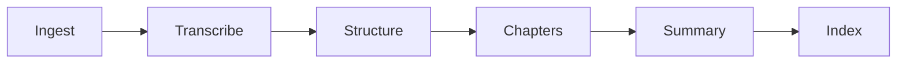

<h1 align="center">VideoMind</h1>

<p align="center">
  
  
  
  
  
  
  
</p>

<p align="center">
  Understand any video without watching it.
</p>

<p align="center">
  <code>transcript</code> · <code>semantic chapters</code> · <code>grounded summary</code> · <code>Q&amp;A over the transcript</code>
</p>

---

## What this is

VideoMind is a live web app: paste a video link or upload a file, and it transcribes it, finds where the topic actually changes, writes a summary that checks its own numbers against the source, and builds a searchable index so you can ask it questions with answers tied to the exact moment they came from.

This repo is the **production deployment** — a FastAPI backend and web UI running on Render, engineered to serve real, concurrent users on a small, memory-constrained instance. It's built on top of the same pipeline developed and iterated on in the **VideoMind-RAG-Pipeline** repo (DVC-driven, local experimentation); this repo is what takes that pipeline and makes it survive contact with the real world — multiple users, limited RAM, and a video platform actively trying to keep automated tools out.

## Pipeline



Chapters and summary run sequentially here — a deliberate tradeoff to keep peak memory low on a small instance, not an oversight. Every stage retries on transient failure, and a chapter or summary failure doesn't take down the rest of the pipeline: whatever succeeded is still served, with the rest gracefully degraded.

## Engineering highlights

This deployment exists because a working pipeline and a working *deployment* are different problems. Four things had to be solved that had nothing to do with the pipeline logic itself:

### Getting YouTube to talk to a datacenter IP at all

Render's IPs are in ranges YouTube's bot detection treats differently from a home connection. Reliable extraction needed three systems working together, correctly, at the same time:

- **Cookies** from a real logged-in session, delivered via a Render Secret File and never committed to the repo
- **A PO Token provider** ([`bgutil-ytdlp-pot-provider`](https://github.com/Brainicism/bgutil-ytdlp-pot-provider)) running alongside the app, satisfying YouTube's bot check
- **A JS runtime** (Node.js) available to yt-dlp, to solve YouTube's separate signature/"n" challenge

Any one of these missing, and extraction fails silently — this is genuinely fragile infrastructure, actively fought over between YouTube and the yt-dlp project, and is documented here as a known, ongoing maintenance surface rather than a solved problem.

### Serving more than one person without them colliding

Every job gets its own isolated artifact tree (`artifact/jobs/<job_id>/`), constructed directly through `VideoPipeline(artifact_dir=...)` rather than bolted on afterward — two users processing videos at the same time never touch each other's files. A bounded semaphore caps simultaneous heavy pipeline work at 2, matched to what the instance can actually hold in memory; a 3rd request is turned away with a clear message rather than silently degrading everyone else's job. Each browser also gets a lightweight identity cookie so a user can't accidentally queue two jobs against themselves.

### Not holding more in memory than the current step needs

- Whisper runs via Groq's API — no model resident in this process at all
- Embeddings are built in batches of 16, with each batch's vectors and text released and garbage-collected before the next batch starts, and metadata written to disk incrementally rather than accumulated in memory
- The LLM connection is created lazily on first use and explicitly released the moment the last LLM-dependent stage (summary) finishes
- `gc.collect()` runs at every stage boundary — not sprinkled everywhere, just at the handful of points where a stage's temporary objects are genuinely done being useful
- Q&A initialization is fully lazy: a completed job stores only its embedding artifact on disk; the FAISS index, metadata, and LLM connection for answering questions are loaded only the first time someone actually asks one, then reused for that job's remaining questions

### Not doing the same work twice

- `/api/validate` and the real download used to independently re-extract the same video's metadata from YouTube. A short-lived, bounded cache (120s TTL, max 2 reuses, max 8 entries) now lets the download reuse what validation already fetched.
- Audio chunking uses `ffmpeg -c:a copy` — a stream copy, not a re-encode — and transcription accepts whatever container that produces (`.mp3`, `.webm`, `.m4a`, `.wav`, `.ogg`, `.flac`) instead of forcing everything through an unnecessary MP3 conversion first.
- Uploaded and downloaded source audio is deleted the moment it's no longer needed — after chunking for uploads, after transcription succeeds for everything — and old finished/failed jobs are pruned automatically as new ones start.

## Concurrency & limits

| Setting | Value | Why |
|---|---|---|
| Max concurrent heavy pipelines | 2 | Matched to instance memory, not arbitrary |
| Max open jobs globally | 2 | A 3rd request is rejected outright, not queued silently |
| Max open jobs per browser | 1 | One user can't starve the other concurrency slot |
| Finished jobs retained | 2 | Older completed/failed jobs are pruned, artifacts deleted |
| yt-dlp validation cache | 120s TTL, 2 reuses, 8 entries | Bounded so it can't grow unbounded across many validations |

## Project structure

```
app.py                 FastAPI backend — job orchestration, concurrency, cleanup
static/                 Frontend (index.html, style.css, script.js)
src/
  components/            One class per pipeline stage
  pipeline/               VideoPipeline / QAPipeline — lazy LLM, per-job artifact roots
  entity/                  Config and artifact dataclasses, all job-artifact-dir aware
  utils/                   Shared helpers — JSON I/O, HF embedding calls
  prompts.py               Every LLM prompt, centralized
  constants.py             Every tunable value, centralized
start.sh                Render entrypoint — cookies, PO token provider, then FastAPI
requirements.txt
```

`artifact/` is written at runtime, per job, and cleaned up automatically — it's never committed.

## Setup

```bash
git clone <your-repo-url>
cd VideoMind
python -m venv .venv
source .venv/bin/activate   # .venv\Scripts\activate on Windows
pip install -r requirements.txt
```

### Environment variables

| Variable | Required | Notes |
|---|---|---|
| `GROQ_API_KEY` | Yes | Transcription + LLM calls. Free tier, no credit card. |
| `HF_TOKEN` | Yes | Embeddings via Hugging Face Inference API. Free, no credit card. |
| `YOUTUBE_COOKIE_FILE` | Yes, for YouTube URLs | Path to an exported `cookies.txt`. On Render: `/tmp/cookies.txt`, populated by `start.sh` from a mounted Secret File. |

### Run locally

```bash
uvicorn app:app
```
Open `http://localhost:8000`.

> Skip `--reload` while a video is actually processing — it watches the whole project tree, including files the pipeline writes at runtime, and will restart the server mid-job.

## Deploying on Render

1. Add `cookies.txt` as a **Render Secret File**, mounted at `/etc/secrets/cookies.txt`.
2. Set `YOUTUBE_COOKIE_FILE=/tmp/cookies.txt` in the service's environment variables.
3. Build command installs the PO token provider alongside the app's own dependencies:
   ```bash
   pip install -r requirements.txt && \
   pip install --upgrade --pre "yt-dlp[default]" && \
   rm -rf bgutil-ytdlp-pot-provider && \
   git clone --depth 1 --branch 2.0.0 \
     https://github.com/Brainicism/bgutil-ytdlp-pot-provider.git && \
   cd bgutil-ytdlp-pot-provider/server && npm ci && npx tsc
   ```
4. `start.sh` copies the cookie file into place, starts the PO token provider on `127.0.0.1:4416`, waits for it to report healthy, then starts FastAPI.

## Known limitations

- Hard-capped at 2 concurrent heavy jobs — deliberate, sized to the instance, not a placeholder number
- Job state lives in memory for the life of the process — a restart loses in-progress and recent job data
- Free-tier APIs mean free-tier rate limits apply
- YouTube extraction depends on the cookie/PO-token/JS-runtime combination staying in sync with what YouTube currently requires — this is an active arms race, not a settled problem

## Related

- **VideoMind-RAG-Pipeline** — the DVC-driven experimentation repo this deployment's pipeline logic is developed in
